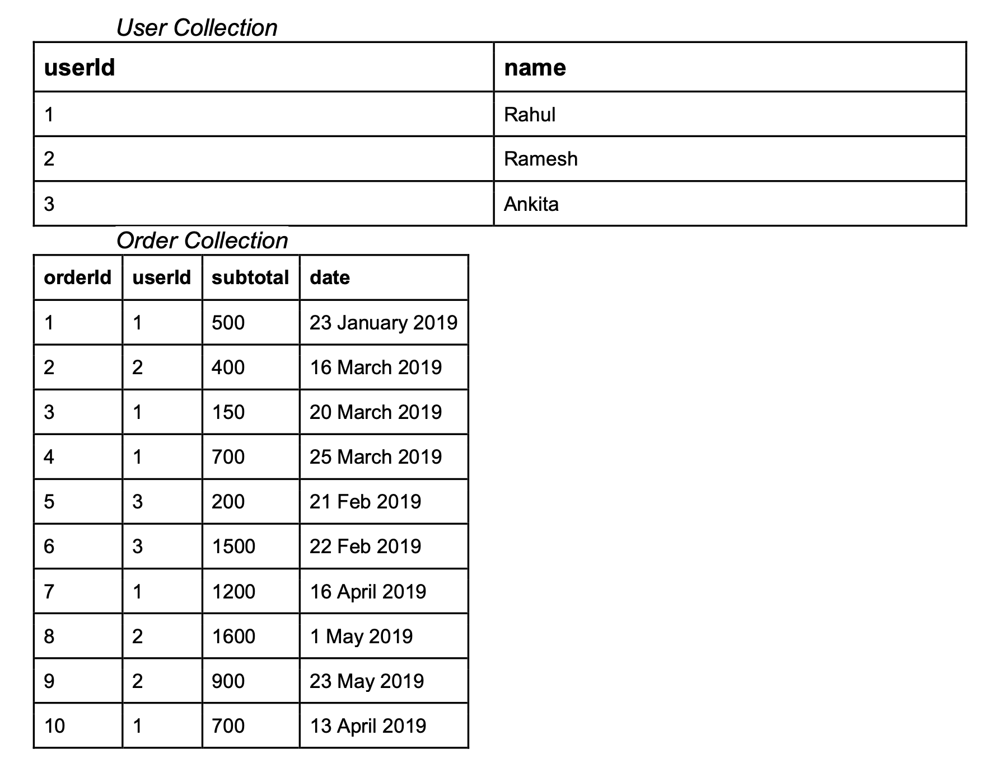
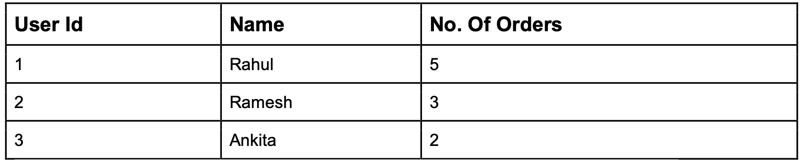

# Origa - Assignment

Origa express assignment app

## Getting Started

These instructions will get you a copy of the project up and running on your local machine for development purposes.

### Prerequisites

```bash
#!/bin/bash
Node@v10.x.x
```

### Installing

A step by step series that will tell you how to get a development env running

```node
#!/.nvm/versions/node/v10.15.3/bin/node
$ npm install
```

### Available Scripts

| Script          | Description |
| --------------- | ----------- |
| `npm run start` | Run the dev |

### Export environment variables

| Variable | Description                             |
| -------- | --------------------------------------- |
| DATABASE | Set this variable for connection string |

### Run at local server

```bash
http://localhost:3000/
```

### Postman Collection

[](https://app.getpostman.com/run-collection/2862f8999929c7ae7c0c)

### Problem Statement



1. Write an API which returns total no of orders placed and average bill subtotal, user wise. Response should be array of user as follows:

```json
[
  {
    "userId": 1,
    "name": "Rahul",
    "noOfOrders": 5,
    "averageBillValue": 650
  },
  {
    "userId": 2,
    "name": "Ramesh",
    "noOfOrders": 3,
    "averageBillValue": 966
  },
  {
    "userId": 3,
    "name": "Ankita",
    "noOfOrders": 2,
    "averageBillValue": 850
  }
]
```

2. A new key is created in user table (noOfOrders) with default value 0, write an API to update it, with its correct value for all users respectively. After calling your API the new User table will be as follows:



### Response of the API

```json
{
  "success": true,
  "message": "Successfully updated"
}
```
